# Advanced Usage

## Copy Image into Rich Text Editor

1. Firstly, [_upload_](./basic#upload) the image file to SQL Connect
2. In SQL Account / SQL Payroll, go to `View` > `File Explorer`
3. Navigate to `This PC` > `SQL Drive on SQL Connect` > double click to open your image file
4. Select All (or press `Ctrl + A`), and then copy it.
5. Go to the rich text editor, paste the image you just copy.

---

## Delete Files in SQL Drive

1. In SQL Account / SQL Payroll, navigate to `View` > `File Explorer`

    

2. Go to `SQL Drive on SQL Connect`, right click on the file and select `Delete`

    

---

## Kill Firebird Connections From Application

> This action requires ADMIN user privilege

### Login Screen

:::warning
    The last logged-in user must be ADMIN; otherwise, the process will fail.
:::

1. In the login screen, click on the `Settings ⚙️`

    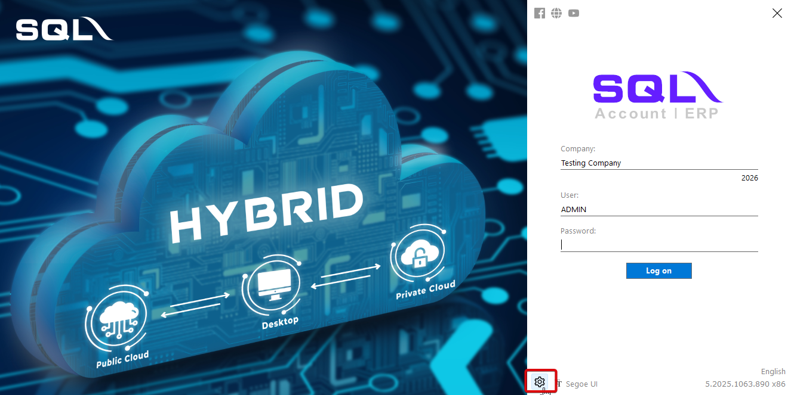

2. Right click on the database, select `Show Active Connections...`

    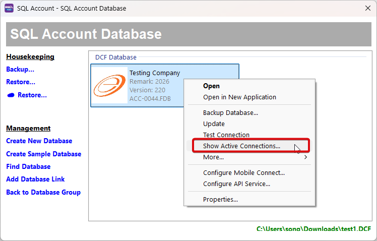

3. Press on the "**Kill**" button to close the connection

    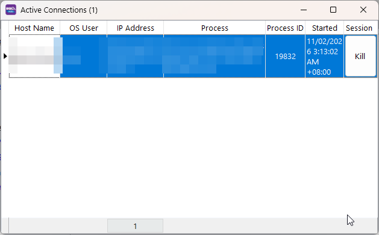

### After Login

1. In the application, navigate to `File` > `Show Active Connections...`

    

2. Press on the "**Kill**" button to close the connection

    

---

## Link with SQL Pos

:::info
This guide applies only to the public cloud; for private‑cloud deployments, you can link as usual, similar to a local setup.
:::

1. First, request SQL Pos integration from your support/dealers. You will receive a file link. In the file, you can find all the information required to link local SQL Pos with SQL Account. Example on how the file looks like:

    

2. In SQL Pos, fill in accordingly.

    

---

## Printing Half Page

### Windows 10

1. Navigate to `Control Panel` > `View devices and printers`
2. Next, select the printer and click on `Print server properties`, add a new page size (half page)

    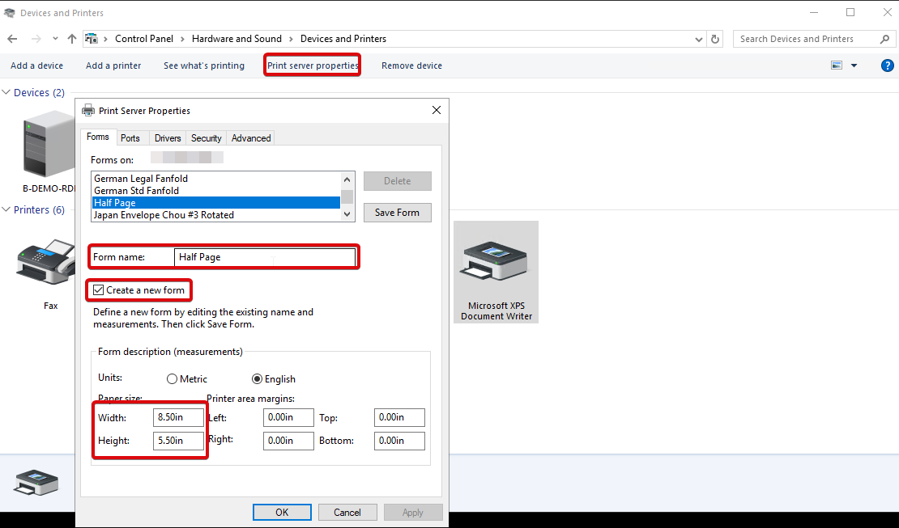

3. Close the form dialog, then click `Add a device` at the top left of the control panel. Add a duplicate printer profile for the desired printer.

    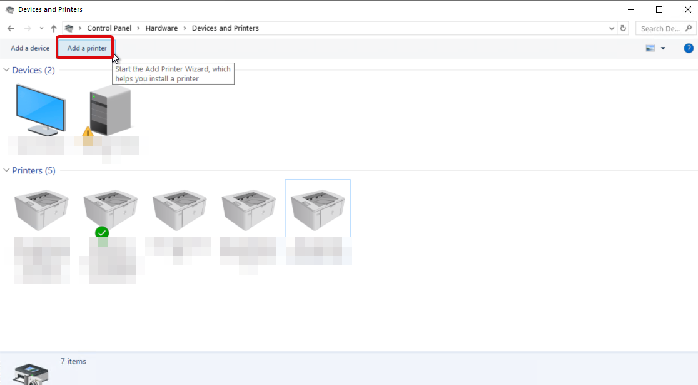

4. Right click on the printer, and go to `printer preferences`, click on the profile we had created.

    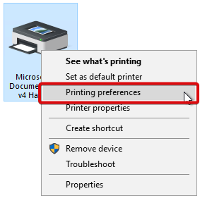

5. Go to "Advanced", configure the printer profile to use the paper size we created before.

    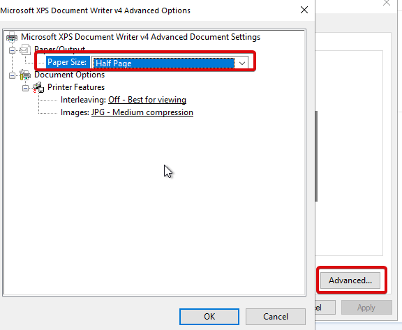

6. Next, right click on the printer again, go to `printer properties`.

    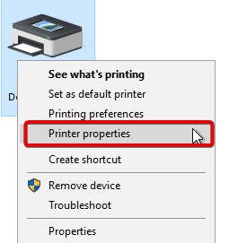

7. Set the default paper size to the custom paper size we created.

    

8. Once you have done with the above settings, login into your SQL Connect session and test print with the following steps:

    
    

### Windows 11

1. Search "Printers" in Windows search bar

    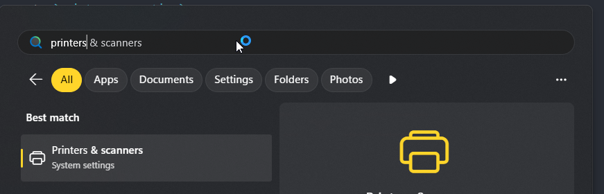

2. Select on `Print server properties`, add a new page size (half page)

    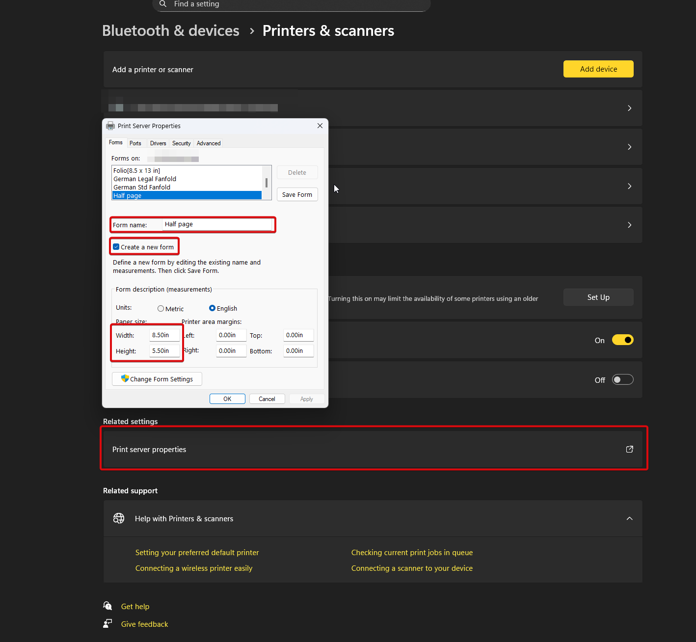

3. click `Add a device` to add a duplicate printer profile for the desired printer

    

4. Click on the desired printer, go to `printer preferences`, select the profile create in previous step

    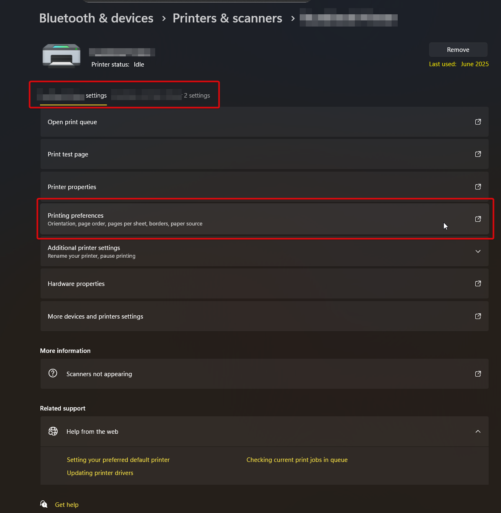

5. Go to "Advanced", configure the printer profile to use the paper size we created before.
6. Next, go to `printer properties`.
7. Set the default paper size to the custom paper size we created.
8. That's all. 🥳

---

## Saving PDF

If you want to download PDF file, save it to the "**Download**" folder in the "**SQL Drive on SQL Connect**"

The PDF file will be opened in a new tab, click download and save the file to local PC.

---

## Signout (Private Cloud only)

:::info
**The is exclusive for private cloud users only.** In private cloud, the user has control over the server. Thus, the administrator has the right to signout connections.
:::

---

## SQL Connect Printing

In SQL Connect, we have two groups of users (Public cloud users & private cloud users). As a private cloud users, you gain an extra option which able to print directly to your local printer as long as the printer is accessible from your server. While for public, you can select any option listed below:

- [PDF Print](#pdf-print)
- [SQL Connect Printer](#sql-connect-printer)
- [SQL Drive method](#sql-drive-method)

### PDF Print

:::info
This feature is available in specific versions:

- SQL Account version 5.2024.976.842 and above
- SQL Payroll version 1.2024.254.204 and above

:::
In SQL Account, go to the report preview, click on the PDF button located at the top left.

The pdf will be open in your new tab, you can then select your local printer and print.

---

### SQL Connect Printer

By using "**SQL Connect Printer**", you will then able to access the browser print dialog which has the right to utilize your local printer. From there, you can select the printer you want, size you like and so on. After select all the options you wish, click print. Below is an example of chrome print dialog:

---

### SQL Drive method

This method should produce identical result compared with [PDF Print](#pdf-print). In SQL applications, export the report as PDF and save it to **"SQL Drive on SQL Connect" > Download** directory

---

## SQL Connect Subscription Checker

To check your subscription, you can open the app by following the steps below:

1. Go to `File > Run`
2. Select `SQL Connect Subscription Checker`

If the app is not there, you can add it manually by following the steps in [SQL Utilities](#sql-utilities)

---

## SQL Utilities

By default, SQL Connect has already generate the list when you connect to a session. But if it didn't show up, you can add them manually by following the steps below:

1. Go to `File > Run > Configure Program...`
2. Add the utilities software from here: `C:\eStream\Utilities`
3. After add successfully, the program should be available at `File > Run > ...`

- Summary:

