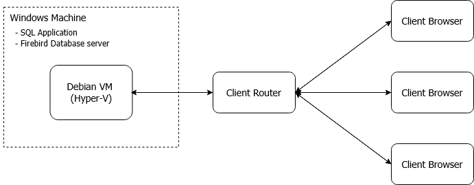

# Big Picture

Diagram below illustrates our private cloud architecture.

- On the Windows machine, SQL applications and Firebird database server will be installed.
- Besides, Hyper-V feature will be enabled.
- We will create a Debian virtual machine using Hyper-V (with BIOS virtualization enabled).
- Total of 2 IPs required.
- 1 IP address for Windows machine itself and another 1 IP address for Debian Virtual Machine.

## How it works?

In the Debian virtual machine, a service will be installed to handle client-browser requests and tunnels the results back. While for Windows and Debian communication, RDP protocol is utilized. To enhance security measurement, no port forward should be opened in the Windows host. The port forward is pointed at the Debian virtual machine, and the services are protected and communication is encrypted. The following are the ports forward required for the Debian virtual machine:

- 8122 (LAN): 22 (WAN) [TCP] ➡️ SSH Port
- 8822 (LAN): 4822 (WAN) [TCP] ➡️ SQL Connect Service Port

Port 4822 is the service port, while port 22 is the SSH port. The SSH port is used in maintenance scheduled tasks.
